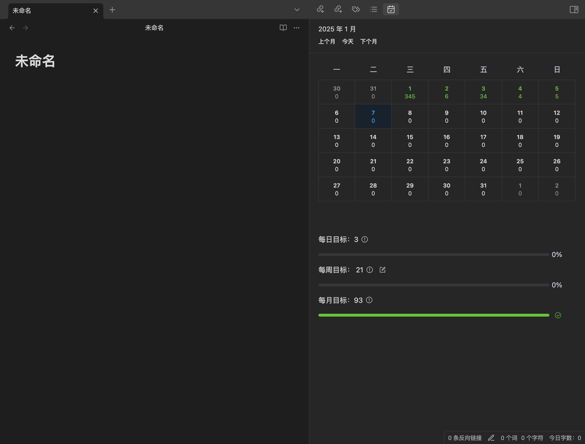

# Obsidian Daily Statistics

## 介绍
统计每日书写的字数，并展示在日历中。

## 功能
- [x] 统计每日字数
- [x] 指定需要统计的文件夹
- [x] 设置每周目标
- [x] 多语言配置：中文、英文
- [x] 不同的语言环境下，每周的开始时间不同
- [x] 鼠标双击日期，修改当日字数
- [x] 切换统计字符还是单词
- [x] 开启与关闭计划
- [x] 手动设置一周的开始时间
- [x] 支持移动端

## 更新
- 2026.03.30 增加输入时长统计

## 饼
- obsidian应用活跃时长统计
- 小黑屋模式：未完成目标禁止退出文件
- 呕吐模式：一段时间内未进行输入即丢失内容
- （没起名的模式）：限制文档活跃时间，超时后禁止编辑文档

## 其他

这个插件的许多功能参考了[obsidian-word-count](https://github.com/lukeleppan/better-word-count) 和 [obsidian-daily-stats](https://github.com/dhruvik7/obsidian-daily-stats)。

